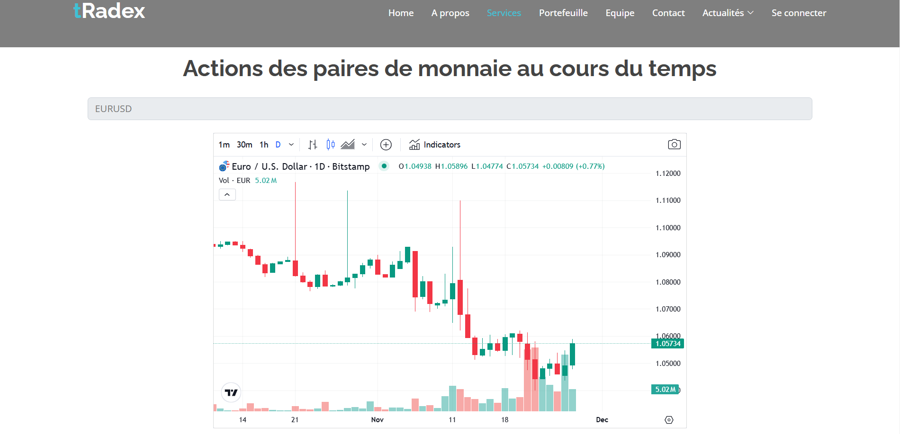
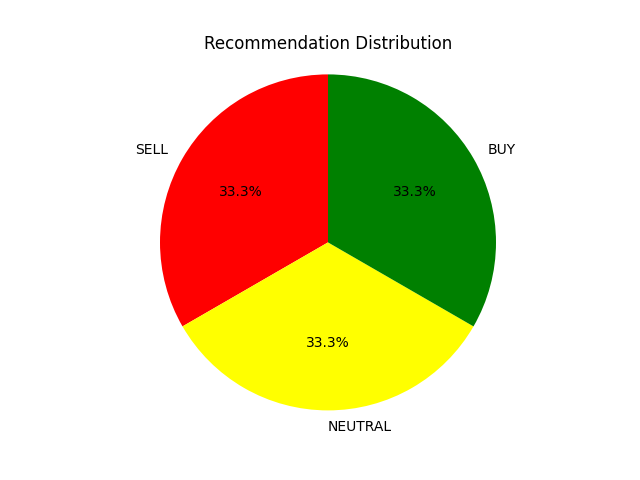
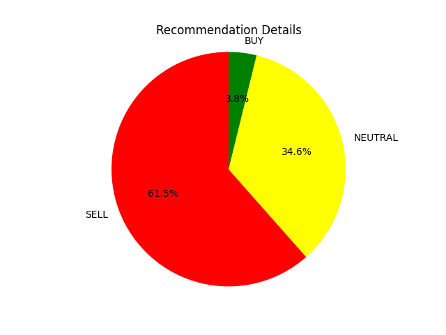
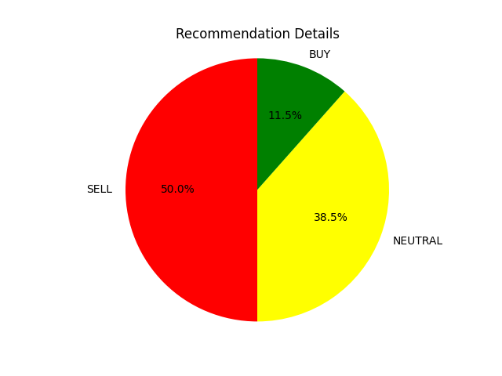

# 🧠 AI Trading System – tRadex  

Un **système de recommandation Forex basé sur l’IA**, développé avec **Flask** pour le backend et **Angular** pour le frontend.  
Il s’agit d’un outil d’aide à la décision pour les traders de devises, capable de fournir des recommandations **d’achat, de vente ou neutre** en temps réel, en s’appuyant sur l’API **TradingView Technical Analysis**.  

---

## 🚀 Fonctionnalités principales  

- 📊 **Visualisation des chandeliers japonais** : affichage en temps réel des graphiques pour les paires de devises sélectionnées.  
- 🤖 **Recommandations IA** : analyse des données techniques et proposition d’une décision claire :  
  - **BUY (Acheter)**  
  - **SELL (Vendre)**  
  - **NEUTRAL (Neutre)**  
- 🎯 **Recommandations graphiques** : génération de **diagrammes circulaires (pie charts)** montrant la répartition des signaux.  
- 🔄 **Multi-paires & multi-intervalle** : choix flexible de la paire de devises et de l’intervalle de temps.  
- 🖥️ **Interface utilisateur Angular** : interface moderne et interactive pour faciliter l’expérience du trader.  

---

## 🎥 Démonstration  

### 1️⃣ Capture d’écran – Interface principale  
Voici un aperçu de l’interface utilisateur de **tRadex** :  

  

---

### 2️⃣ Vidéo – Simulation de l’interface  
La vidéo montre :  
- 📈 Comment les **graphiques de chandeliers japonais** permettent d’analyser visuellement les tendances du marché.  
- 🤖 Comment l’outil **AI Recommendation** propose une décision (BUY, SELL ou NEUTRAL) pour la paire sélectionnée.  

[🎬 Voir la vidéo de démonstration](tradex_vid.mp4)  

---

### 3️⃣ Exemples de sortie – Pie Charts  
Voici trois exemples de résultats générés par l’IA sous forme de **diagrammes circulaires** (Pie Charts).  
Ces graphiques représentent la répartition des recommandations :  

| Exemple 1   | Exemple 2    | Exemple 3       |
|-------------|--------------|-----------------|
|  |  |  |  

---

## 🎯 Objectif du projet  

Ce projet fait partie de mon portfolio et illustre :  
- Mes compétences en **IA appliquée au trading**  
- La mise en place d’un **backend en Flask** connecté à une API tierce  
- La création d’une **interface frontend moderne avec Angular**  
- L’intégration de **visualisations interactives** pour l’aide à la décision  

---
## 📌 À propos  

Ce projet inclut également le fichier **`forexAPI.py`**, qui représente le cœur logique de l’AI Trading System.  
C’est ce fichier qui se connecte à l’API TradingView, traite les données et génère les recommandations (BUY, SELL, NEUTRAL).  

📧 Contact : *youssefbenyahia6@gmail.com*  
🌍 Portfolio : *https://youssef0612.github.io/Portfolio/*  

